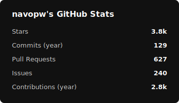
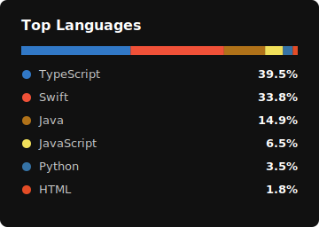

### Hey, I'm Stan

I build small, sharp developer tools for macOS, the browser, and the web. Based in Germany.

---

#### Now

- Shipping [`leafblower`](https://github.com/navopw/leafblower): native macOS disk analyzer
- Tinkering with [`graphmaid`](https://github.com/navopw/graphmaid) and [`nicer-tab`](https://github.com/navopw/nicer-tab)
- Open to OSS collabs

#### Latest releases

<!-- releases:start -->
- [leafblower v1.0.6](https://github.com/navopw/leafblower/releases/tag/v1.0.6) - 2026-07-22
<!-- releases:end -->

#### Stats

  
  

#### Stack

